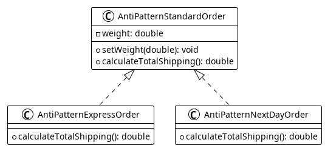
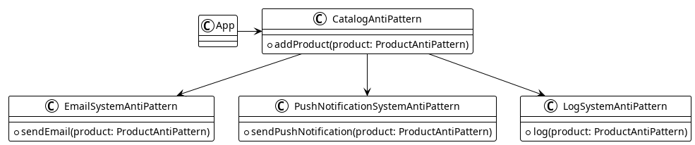
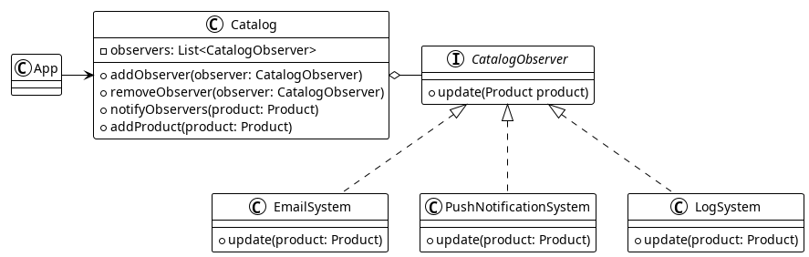

# Design Patterns


## Run

```sh
./mvnw exec:java -Dexec.mainClass="br.dutrajy.designpatterns.App"
```


## Strategy

Anti pattern:



Pattern:


## Composite

Anti pattern:


Pattern:


## Facade

Anti pattern:


Pattern:


## Singleton

Pattern:


## Observer

Anti pattern:



Pattern:


